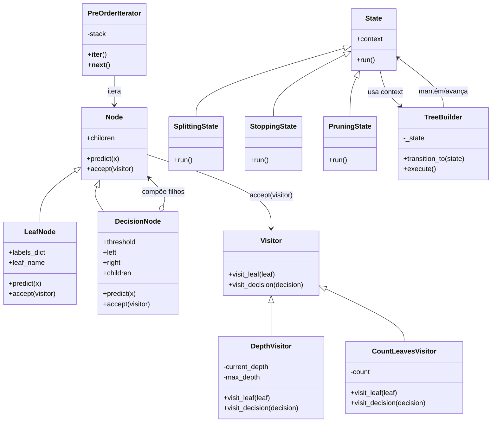

```mermaid
classDiagram
    class Node {
        +predict(x)
        +accept(visitor)
        +children
    }
    class LeafNode {
        +predict(x)
        +accept(visitor)
        +labels_dict
        +leaf_name
    }
    class DecisionNode {
        +threshold
        +left
        +right
        +predict(x)
        +accept(visitor)
        +children
    }
    Node <|-- LeafNode
    Node <|-- DecisionNode
    DecisionNode o--> Node : compõe filhos

    class PreOrderIterator {
        -stack
        +__iter__()
        +__next__()
    }
    PreOrderIterator --> Node : itera

    class Visitor {
        +visit_leaf(leaf)
        +visit_decision(decision)
    }
    class DepthVisitor {
        -current_depth
        -max_depth
        +visit_leaf(leaf)
        +visit_decision(decision)
    }
    class CountLeavesVisitor {
        -count
        +visit_leaf(leaf)
        +visit_decision(decision)
    }
    Visitor <|-- DepthVisitor
    Visitor <|-- CountLeavesVisitor
    Node --> Visitor : accept(visitor)

    class State {
        +context
        +run()
    }
    class SplittingState {
        +run()
    }
    class StoppingState {
        +run()
    }
    class PruningState {
        +run()
    }
    State <|-- SplittingState
    State <|-- StoppingState
    State <|-- PruningState

    class TreeBuilder {
        -_state
        +transition_to(state)
        +execute()
    }
    TreeBuilder --> State : mantém/avança
    State --> TreeBuilder : usa context
```