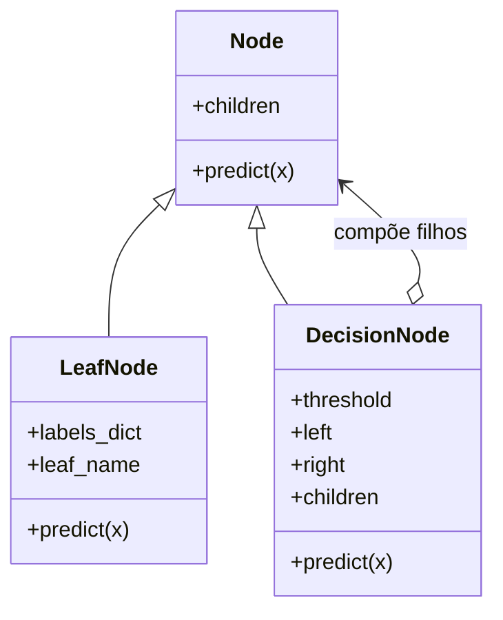

```mermaid
classDiagram
    class Node {
        +predict(x)
        +children
    }
    class LeafNode {
        +predict(x)
        +labels_dict
        +leaf_name
    }
    class DecisionNode {
        +threshold
        +left
        +right
        +predict(x)
        +children
    }
    Node <|-- LeafNode
    Node <|-- DecisionNode
    DecisionNode o--> Node : compõe filhos

```